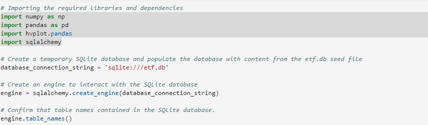
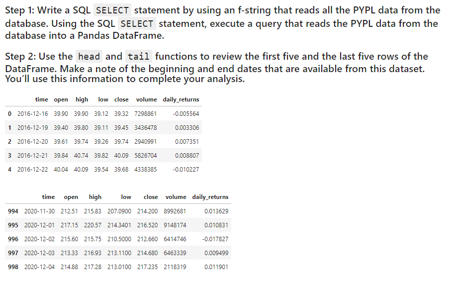
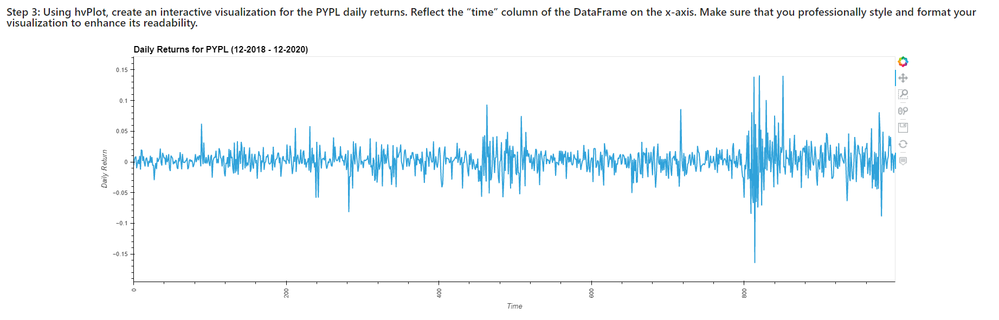
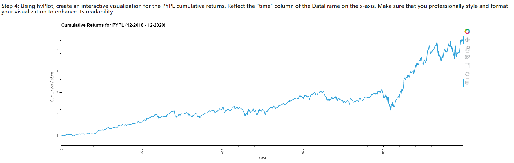
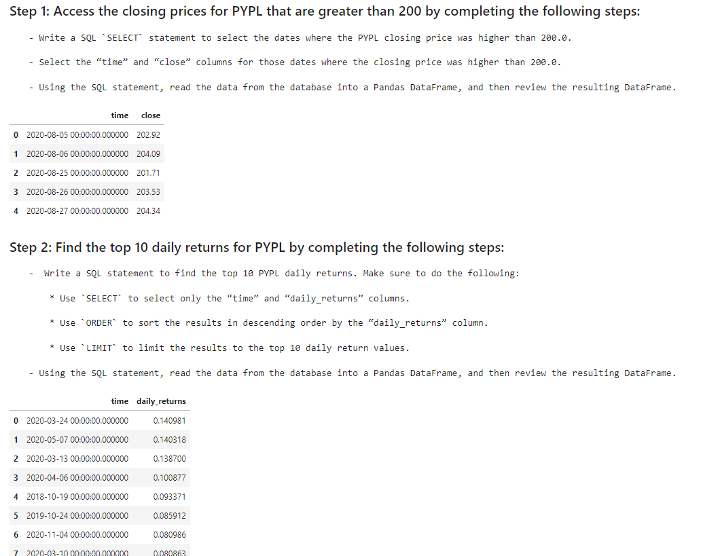
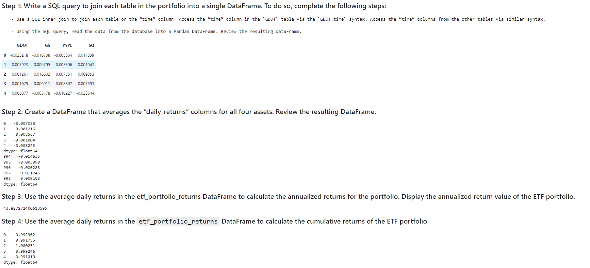
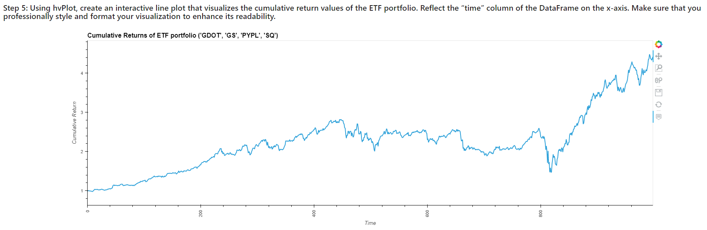

# Analyze-Hypothetical-Fintech-ETF
This application builds a financial database and web application by using SQL, Python, and the Voilà library to analyze the performance of a hypothetical fintech ETF.


We will use this notebook to complete the analysis of a fintech ETF that consists of four stocks: GDOT, GS, PYPL, and SQ. Each stock has its own table in the etf.db database.

Analyze the daily returns of the ETF stocks both individually and as a whole. Then deploy the visualizations to a web application by using the Voilà library.

The detailed instructions are divided into the following parts:

 * Analyze a single asset in the ETF

 * Optimize data access with Advanced SQL queries

 * Analyze the ETF portfolio

 * Deploy the notebook as a web application


---

## Technologies

This project leverages Anaconda and JupyterLab with Python 3.9:

* [Anaconda](https://www.anaconda.com/products/individual) 

Need to import the following libraries and dependencies:

```
import numpy as np
import pandas as pd
import hvplot.pandas
import sqlalchemy

```

---

## Installation Guide

Before running the application first install the following dependencies.

### Part I--Install Anaconda
1. Install [Anaconda](https://www.anaconda.com/products/individual) from link 
2. Open up GitBash(Windows) or Terminal(Mac)
3. Type ```conda update conda``` to update Conda
4. Type ```conda update anaconda``` to update Anaconda
5. Type ```conda create -n dev python=3.9 anaconda```
6. Type ```conda activate dev``` to activate conda
7. Install a dev environment kernel by typing ```python -m ipykernel install --user --name dev```
8. Install a node environment by typing ```conda install -c conda-forge nodejs```
9. Launch JupyterLab by typing ```jupyter lab```

### Part II--Install SQLAlchemy


SQLAlchemy is an open-source SQL library for Python. It’s designed to ease the communication between Python-based programs and databases. The SQLAlchemy library should have installed on your computer as part of the Anaconda download.

To confirm that SQLAlchemy installed in your Conda ```dev``` environment, open a terminal window, and then complete the following steps:

Activate your Conda ```dev``` environment.

Run the following command:

```
conda list sqlalchemy

```
If SQLAlchemy is already installed, ```sqlalchemy``` and its version number will display in your terminal, as the following image shows. In this case, you don’t need to do anything further for SQLAlchemy. Move to the next section to install Voilà.

### Part III--Install Voilà

With Voilà, a Python library, you can convert a Jupyter notebook into a live webpage. You’ll need this library later in the module when you create web applications that use databases.

To install Voilà, open a terminal window, and then complete the following steps:

Activate your Conda ```dev``` environment.

Run the following command:

```
conda install -c conda-forge voila

```

Confirm that the installation succeeded by running the following command:

```
conda list voila
```

---

## Usage

You will need to clone the repo so that you can run the application:

```
 git clone https://github.com/locthai2002/Analyze-Hypothetical-Fintech-ETF.git
```

Here are some screenshots from running the application:

## Import the Libararies



## Analyze a Single Asset in the ETF







## Optimize Data Access with Advanced SQL Queries



## Analyze the ETF Portfolio



## Deploy the Notebook as a Web Application




---

## Contributors

Loc Thai -- www.linkedin.com/in/loc-thai-69b8a2141
Phone: 415.400.9998

---

## License

MIT


